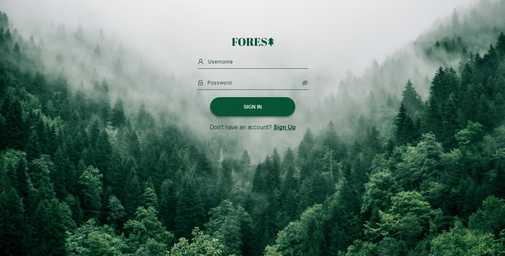
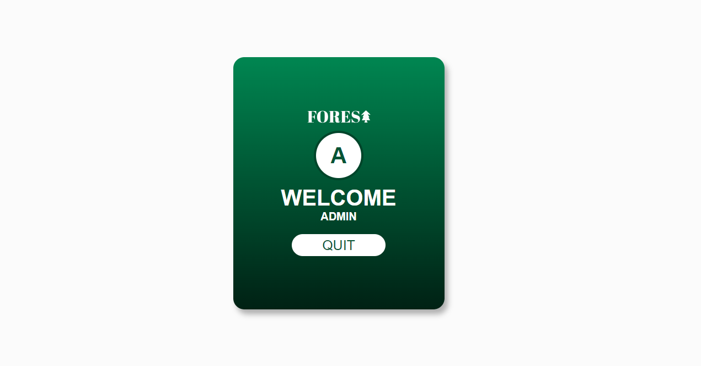

# Login-Screen - FOREST

## Descrição

Este projeto trata-se de uma tela de login para uma empresa fictícia chamada "FOREST", que trabalha com a proteção das florestas do mundo. A tela de login solicita o nome de usuário e uma senha e redireciona para a página de perfil. Na página de perfil a única coisa que se pode fazer é sair da página. Caso o usuário venha a tentar acessar a página de perfil sem se logar antes, ele será redirecionado para a página de login. Caso ele tentente acessar uma página que não existe, será mostrada uma página que diz "Page Not Found" e um botão para voltar a tela de login. 

Visando manter o projeto simples, a autenticação serve para somente um usuário **(Username: admin - Password: admin)**, sendo assim, não exite a opção de se cadastrar e nem uma conexão com uma API.

Neste projeto aprendi um pouco mais sobre autenticação e rotas públicas e privadas utilizando o **React-Router-Dom**.

## Tecnologias utilizadas

 
 

- React JS (react-router-dom, hooks, etc.);
- Javascript;
- HTML5;
- CSS.

## Screenshots

### Gif mostarando o processo de login

### Login page

### Profile Page

### Page Not Found

